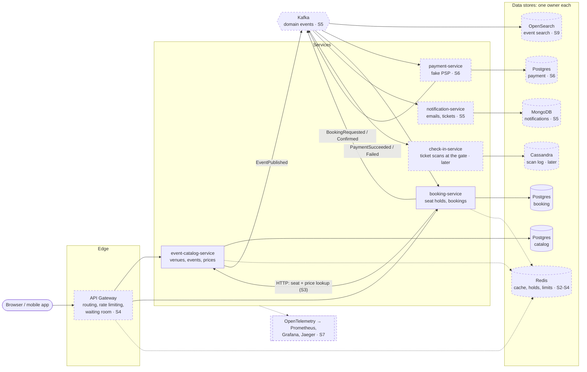

# Architecture

Target architecture. Solid boxes exist today; dashed boxes are planned (stage in brackets).

## Where each kind of database fits, and why

| Store | Type | Used for | Why this one |
|---|---|---|---|
| **Postgres** | Relational | catalog, booking, payment | Transactions, constraints, joins. Overbooking is prevented *by the database* (constraints, atomic updates) |
| **Redis** | Key-value, in memory | Catalog cache, seat holds with TTL, rate-limit counters, hot ticket counters | Microsecond reads, atomic `INCR`/`DECRBY`, keys that expire by themselves. Data is mostly rebuildable |
| **MongoDB** | Document | Notification templates and delivery log | Each channel (email, SMS, push) has a different shape; documents are read and written whole, never joined |
| **OpenSearch** | Search index | "Taylor Swift concerts in Europe next month" | Full-text search, filters and facets that SQL `LIKE` can't do well. A read model built from Kafka events |
| **Cassandra** | Wide-column | Ticket scans at venue gates | Huge write bursts (50,000 scans in 30 min), append-only, always read by key (event + ticket). Scales writes horizontally |

Rule of thumb: **start relational; add a specialised store when an access pattern clearly needs it** and you can name
the trade-off (usually weaker transactions or eventual consistency in exchange for speed or scale).
Each store has exactly one owning service. Others get the data through APIs or events.
